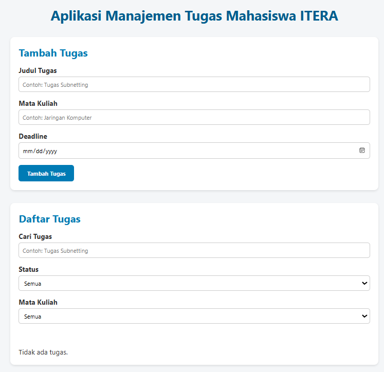
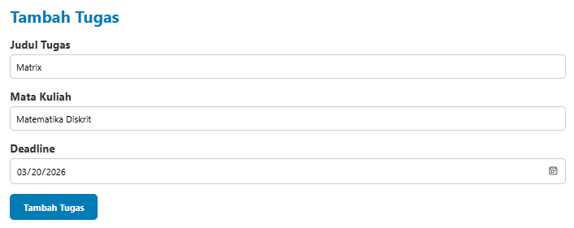
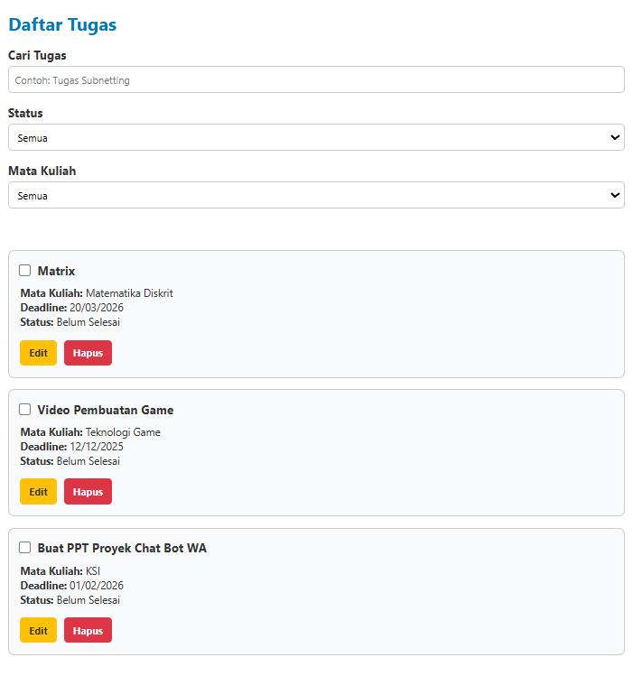
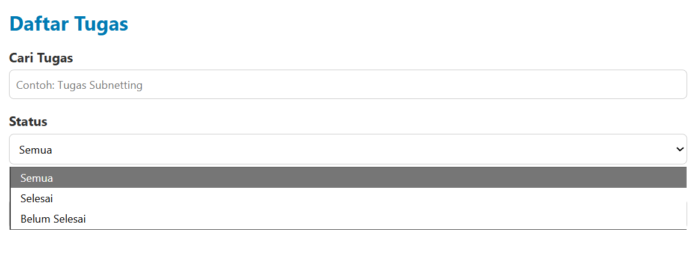
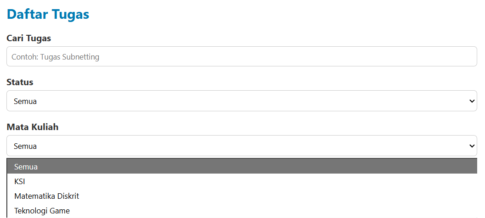
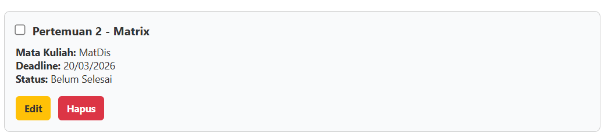
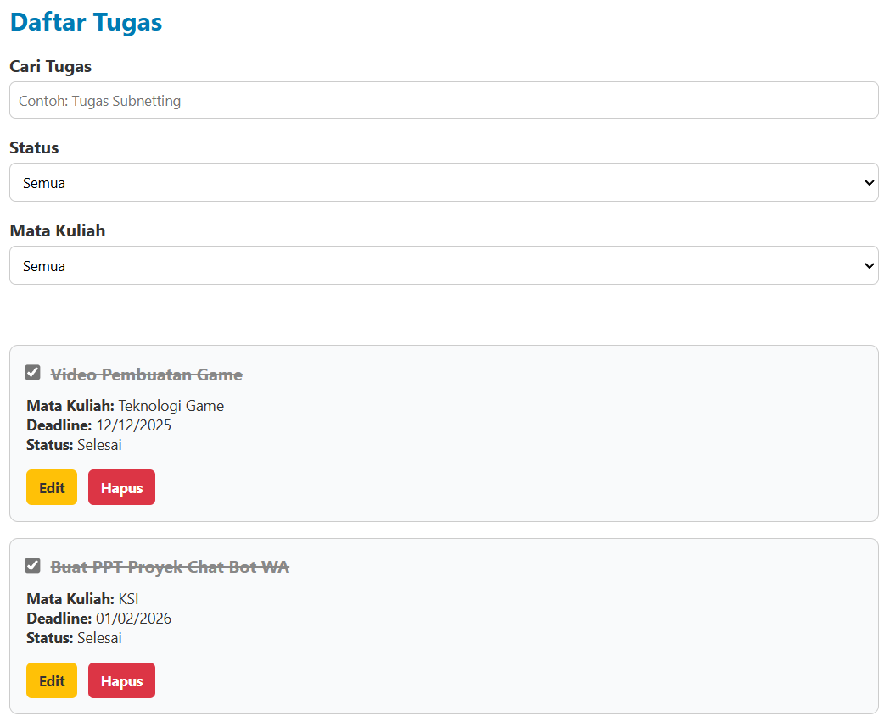

# Aplikasi Manajemen Tugas Mahasiswa ITERA

  

## Fungsi Aplikasi

Aplikasi ini berfungsi sebagai alat bantu bagi mahasiswa dalam mencatat tugas-tugas yang ia miliki. Tugas-tugas yang tertata dan tercatat dengan baik akan membantu mahasiswa dalam mengatur waktunya sehingga dapat menurunkan tingkat keterlambatan pengumpulan tugasnya.

## Fitur Utama

### 1. Tambah tugas

  

Setelah menekan tombol "Tambah Tugas", data akan tersimpan melalui *localStorage*.

### 2. Daftar tugas

  

Menampilkan seluruh daftar tugas yang telah disimpan lengkap dengan:
- Nama tugas  
- Mata kuliah  
- Deadline  
- Status (selesai / belum selesai)
Daftar ini diperbarui otomatis setiap kali pengguna menambah, mengedit, atau menghapus tugas.

### 3. Pencarian tugas
Pencarian bisa dilakukan dengan tiga cara: mencari berdasarkan nama tugas; mencari berdasarkan status; mencari berdasarkan nama mata kuliah.
#### Filter by status

  

Fitur ini memudahkan pengguna untuk **menampilkan daftar tugas berdasarkan status penyelesaian**.  
Pengguna dapat memilih salah satu opsi dari menu drop-down:
- **Semua** – Menampilkan semua tugas.  
- **Selesai** – Menampilkan hanya tugas yang sudah ditandai selesai.  
- **Belum Selesai** – Menampilkan tugas yang masih belum dikerjakan.  

#### Filter by matakuliah

  

Fitur ini berfungsi untuk **menampilkan tugas berdasarkan nama mata kuliah tertentu**.  
Daftar mata kuliah yang muncul pada menu filter dihasilkan **otomatis dari tugas-tugas yang sudah pernah dimasukkan**.  
Dengan demikian, pengguna bisa dengan cepat fokus pada tugas dari satu mata kuliah tanpa harus menelusuri daftar panjang.

### 4. Edit tugas

  

Fitur ini memungkinkan pengguna untuk **memperbarui informasi tugas** yang sudah dibuat.  
Perubahan bisa dilakukan pada:
- **Judul tugas**
- **Mata kuliah**
- **Tanggal deadline**
- **Status tugas (selesai/belum selesai)**
Semua hasil edit akan langsung disimpan ke localStorage, dan daftar tugas akan diperbarui secara otomatis.

### 5. Hapus tugas

  

Fitur **hapus tugas** digunakan untuk menghilangkan data tugas yang sudah tidak diperlukan.  
Setelah menekan tombol **“Hapus”**, sistem akan langsung:
- Menghapus tugas dari daftar tampilan.
- Menghapus data dari penyimpanan localStorage.
Dengan demikian, daftar tugas yang tersisa selalu bersih dan relevan dengan kebutuhan pengguna.

## Penjelasan teknis penggunaan localStorage
- Saat pengguna menambahkan tugas, seluruh data (judul, mata kuliah, deadline, status) disimpan dalam array JavaScript bernama arrayTasks.
- Array tersebut dikonversi ke format JSON dan disimpan ke browser dengan perintah: localStorage.setItem('tasks', JSON.stringify(arrayTasks));
- Ketika halaman dimuat ulang, aplikasi akan membaca kembali data dari localStorage menggunakan: arrayTasks = JSON.parse(localStorage.getItem('tasks')) || [];
- Dengan mekanisme ini, data tetap tersimpan permanen di sisi pengguna, bahkan setelah browser ditutup, sampai pengguna menghapusnya secara manual.

## Validasi Form
Alur Validasi yang terjadi :
1. Pengguna menekan tombol “Tambah Tugas”.
2. Sistem memeriksa apakah kolom judul dan deadline sudah diisi.
3. Sistem memastikan format tanggal benar.
4. Jika semua valid, data disimpan; jika tidak, sistem menampilkan pesan kesalahan (alert).
